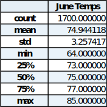
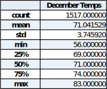
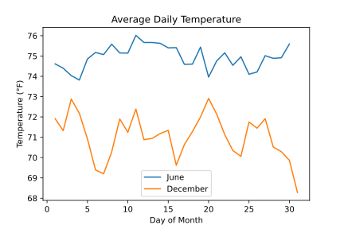
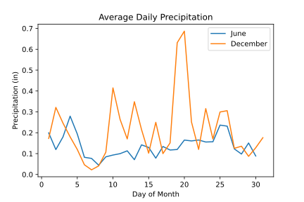
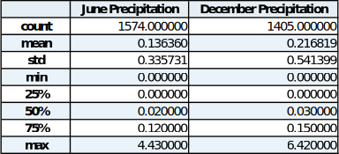

# **Surf Weather Analysis**

## **Overview of Project**
The goal of this project is to analyze a SQLite database of weather data from the island of Oahu using python tools such as SQLAlchemy and pandas. The results of interest are the statistics for temperature and precipitation in the months of June and December to get a feel for the differences between summer and winter in Hawaii. This exercise could serve as a first investigation into whether it would make sense to open a shop based on outdoor warm weather activities with the hope that it would be able to do well all year round.

The data has been gathered from nine weather stations across Oahu from January 2010 to August 2017. The result of SQLAlchemy reflection of the database reveals a measurement and station table with the following fields:

| Measurement | Station   |
| ----------- | --------- |
| id          | id        |
| station     | station   |
| date        | name      |
| prcp        | latitude  |
| tobs        | longitude |
|             | elevation |

The abbreviations *prcp* and *tobs* refer to precipitation in inches and temperature observations in degrees Fahrenheit respectively. All analysis is performed in the *[SurfsUp_Challenge.ipynb](/SurfsUp_Challenge.ipynb)* notebook.

>##### Note: Additional challenges are covered in the files *climate_analysis.ipynb* and *app.py* including creating a Flask application to display weather analysis results.

## **Analysis and Results**
There are two main deliverables for this project, one for each month of interest, that are detailed below.

### **Deliverable 1**
The first deliverable for this analysis is to produce a statistical summary of all the temperatures recorded in June. Using the SQLAlchemy `session.query()` method, temperature observations are first filtered by the extracted month value from the date field to leave just the data for June. Then the data is returned as a list of tuples via the `all()` method. Converting the result into a pandas DataFrame and using the `describe()` method yields the following:

    

### **Deliverable 2**
The second deliverable is the same as the first with the month changed to December. Repeating the same steps as in deliverable 1, the results for temperatures in December are retrieved with the statistical summary as shown below:

    

### **Comparing the Temperature Statistics**
The following observations are made using the two tables above:
- The average temperature for June is almost 4 degrees higher than in December. This is to be expected as June is a summer month whereas December is a winter month for Hawaii.
- As far as low temperatures go, December produced a minimum temperature 8 degrees lower than in June. On the opposite end of the spectrum, the maximums were only different by 2 degrees.
- The standard deviations of 3.26 and 3.75 for June and December respectively reveal that the weather in December is a little more variable than in June (slightly higher dispersion from the mean).
- In the winter month of December, only 25% of observations ever dipped below 69°F which favorable result for a winter month.

## **Summary**
The results from the two analysis deliverables show that the temperatures in both summer and winter in Oahu would work quite well for a shop who's success is dependent on warm weather. Both months analyzed yielded averages in the 70's and similar distributions about the averages with December showing higher variability but not by much. Overall, most of the temperature observations in both months had values in the 70's or higher.

In order to form a more complete picture, there are a couple of additional queries that were performed on the same months. The first query looks at the daily averages of temperature and precipitation in June and December. Two subqueries are constructed using the `subquery()` method on filtered and grouped datasets (filtered by month and grouped by day). The subqueries were then joined forming one DataFrame from which the following charts are constructed:

    

- The trend of temperatures across each month is relatively flat and thus consistent with December's observations once again confirming higher variability and dispersion compared to June.

    

- The precipitation results show that December in general has more rain throughout the month compared to June. The majority of results for both datasets are within a small range of about 2-3 tenths of an inch and thus are pretty consistent across the month.

The second additional query included in this report is a statistical summary for the precipitation in both months.

    

- 75% of the observations are below 0.12 and 0.15 inches for June and December respectively. This is all while the temperatures are in the 70's, for the most part, in both months, thus giving good to great conditions most of the time.

This concludes the findings of this report. Future work could extend the scope of each query to additional months to get a better feel for how the trends might change throughout the rest of the year.